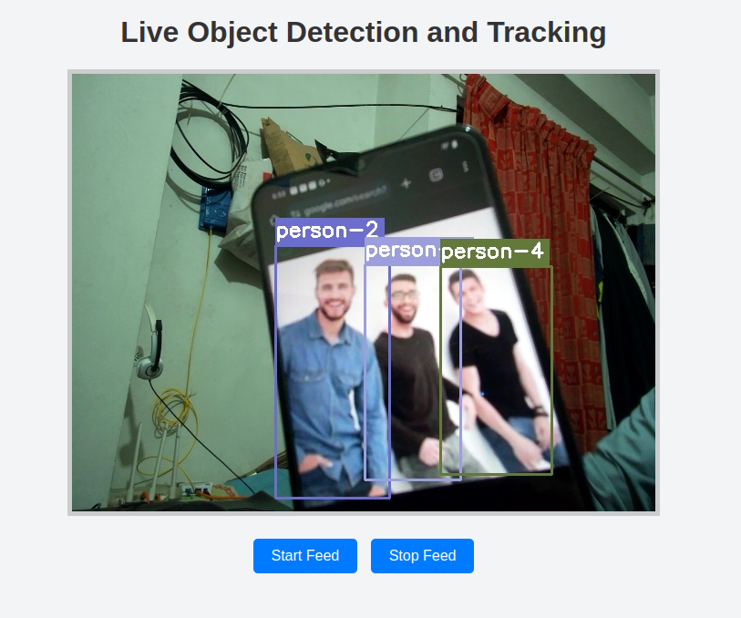

# Yolov4 and Deepsort based human tracking

This repo provides a detailed account of the real-time object detection and tracking system developed using YOLOv4 and Deep SORT, optimized for deployment on embedded edge devices like the Jetson Nano. The system efficiently detects and tracks multiple objects in a video stream with real-time performance.

## Steps to run Code

- Clone the repository
```
git clone https://github.com/rukon-uddin/Object-Tacking-For-Embedded-Device.git
```
- Goto the cloned folder.
```
cd Object-Tacking-For-Embedded-Device
```
- Install the dependecies
```
pip install -r requirements.txt
```

- For running the flask app for yolov4 object detection and tracking

```
python app.py
```

### RESULTS

#### Human Detection and Tracking 


